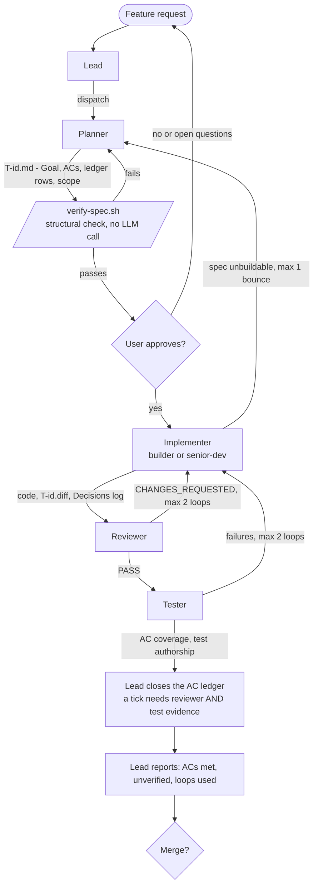
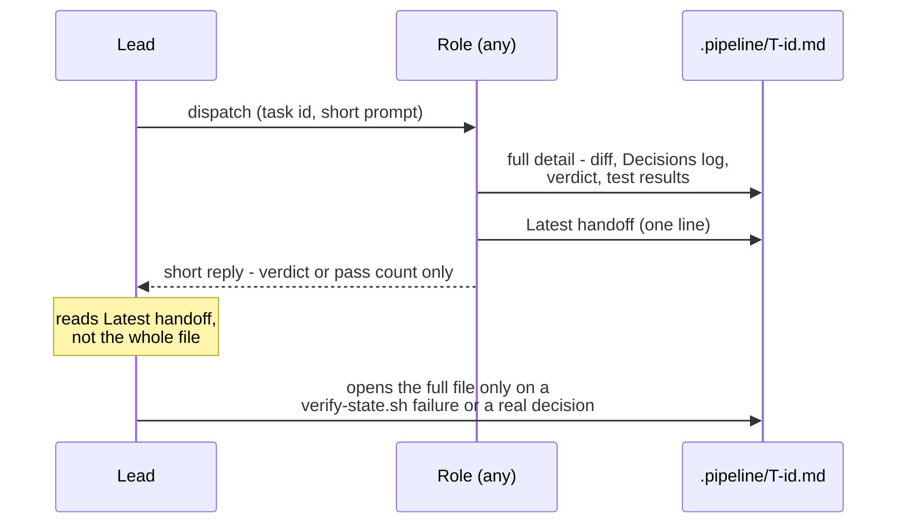
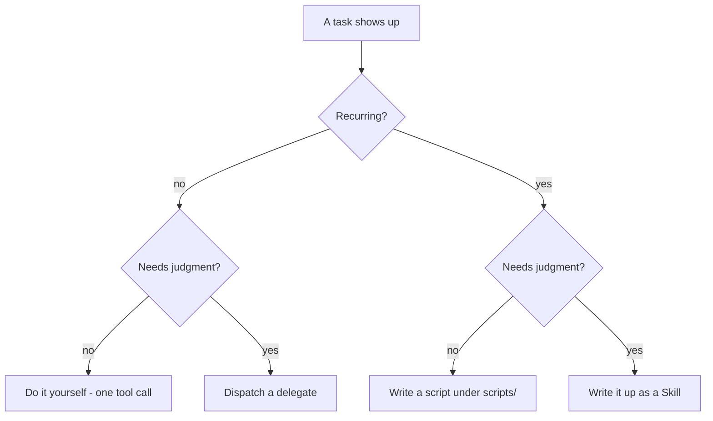

# agent-toolkit

A reusable version of the planner → implement → review → test multi-agent
pipeline: Claude, Codex, or OpenCode as the lead, matching-tool planning,
OpenCode (any vendor) for cross-vendor implement/review/test, a state file
(`.pipeline/T-<id>.md`) as the single handoff surface between roles, and a
`delegate` skill so the lead's own context stays small across a long run. 

It was distilled from real multi-agent pipeline runs and hardened there
over time, so the same setup — permissions, session-reuse policy,
cross-vendor independence rules, the state-file contract — doesn't get
re-invented and re-debugged from scratch in every new repo.

OpenCode is also a supported direct lead: `/feature` and `/toolkit-update`
select a `leader` adapter, and its `planner` references the canonical role
instructions. No Claude or Codex CLI is required; the generated `.claude/`
files remain shared instruction sources, not executable dependencies.

Codex is a supported lead: the scaffold includes project instructions,
a `feature` skill, a `toolkit-update` skill, and a Codex planner. For any other
lead tool, read [`SYSTEM.md`](SYSTEM.md) — one tool-agnostic page meant to be
handed to an AI ("recreate this system, with yourself as the lead").

Both leads store writable task records and runtime files in `.pipeline/`;
Codex skills remain in `.agents/skills/`. Existing projects must apply
[the directory migration](migrations/02-pipeline-directory.md) at a task boundary.
See [Codex lead operation](docs/CODEX.md) for session pins, hook trust,
permissions, recovery, and live verification.

## How it flows

### Standalone visual dashboard

From any project with `.pipeline/` task records, run:

```bash
./scripts/dashboard
```

Init installs this self-contained command in the project. It does not need the
toolkit checkout to remain on disk. You can still use
`/path/to/agent-toolkit/bin/dashboard` for projects without the installed copy.

It discovers the project from your current directory (including nested folders),
shows live pipeline boxes/task cards, and refreshes every two seconds. No Herdr,
agent CLI, server, or model calls required. Python 3.8+ on macOS/Linux is enough.
Use arrows or `j/k` to scroll, `b` for blocked tasks, and `q` to close.

For another project or a plain-text snapshot:

```bash
./scripts/dashboard --project /path/to/project
./scripts/dashboard --once
```

Optionally add the toolkit's `bin/` directory to your shell's `PATH` to run
`dashboard` from any project. No project files are installed or changed. The
standalone command shares the optional Herdr adapter's renderer; it does not
call Herdr. Displayed progress is recorded data, not independent verification.

For an existing stamped scaffold, preview the addition and then install it:

```bash
bash /path/to/agent-toolkit/bin/init.sh --update --target . --only scripts/dashboard
bash /path/to/agent-toolkit/bin/init.sh --target .
```

The preview writes nothing (exit 1 means new/differing files). The plain run
adds missing files only, loading the original settings from the provenance
stamp. Future dashboard changes appear in `/toolkit-update` triage like other
generated files; local customizations are never overwritten by a re-run.




Every arrow into or out of a role is really a write to, or a read from,
`.pipeline/T-<id>.md` — see below.

### Context stays small, by construction




A role's chat reply is a receipt, not the record — the record is always the
file. That's what keeps the lead's own context flat whether the run has one
task or twenty: it never accumulates a second copy of every diff, verdict,
and test log it dispatched.

### Role permissions at a glance


| Role                                   | Reads                  | Writes                                      | Notes                                                   |
| -------------------------------------- | ---------------------- | ------------------------------------------- | ------------------------------------------------------- |
| Lead                                   | state file             | the acceptance-criteria ledger, Status      | the only role that records whether a criterion was met  |
| Planner                                | whole repo             | `.pipeline/T-<id>.md` only                    | never touches source; owns criteria *text*, not outcome |
| Implementer (`senior-dev` / `builder`) | whole repo             | source + `.pipeline/T-<id>.diff` + state file | the only roles that edit source                         |
| Reviewer                               | whole repo (read-only) | state file only, or nothing — see below     | blanket `edit`/`write: deny` by default in this toolkit |
| Tester                                 | whole repo (read-only) | `<test-dir>/**` + state file only           | never fixes, only reports                               |


The reviewer template ships **safer than it has to be** — blanket deny, not
scoped-allow on `.pipeline/**` — because a permission block that reads
correctly in YAML isn't proof it's enforced by the runtime. Loosen it only
after verifying that live against your own OpenCode server (see "Design
decisions" below).

Codex's planner uses a `workspace-write` sandbox because it must create the
state file. That sandbox does not scope writes to `.pipeline/**` alone, so its
source-read-only boundary is explicit role instruction rather than filesystem
enforcement. This limitation is stated in the generated planner file rather
than hidden.

## What's in it

```
bin/init.sh           the scaffolder — copies templates/ into a target repo
                        (--update: diffs current templates against a target
                        that's already scaffolded, writes nothing)
bin/release.sh        the releaser — checks clean tree/main/changelog heading,
                        then annotated tag + push (drafting the entry is the
                        toolkit-release skill's job)
test/smoke.sh         automated smoke test for the guarantees above (run by CI)
test/invariants.sh    asserts every load-bearing rule is present in each of the
                        hand-synced copies that must carry it (run by CI) —
                        catches the omission that hand-syncing keeps producing
CHANGELOG.md          impact-tagged per-release changes ([contract] › [safety]
                      › [process] › [docs]) — read this before merging an update
migrations/           hand-appliable notes for [contract] changes only
integrations/herdr/   optional plugin: adopt an existing lead, show task records,
                       and add support panes without requiring team.sh
templates/             every generated file, with __PLACEHOLDER__ tokens
  claude/agents/        planner.md.tmpl, senior-dev.md.tmpl
  claude/commands/      feature.md.tmpl — the /feature pipeline command;
                          toolkit-update.md.tmpl — the /toolkit-update merge command
  codex/                AGENTS.md.tmpl, project-scoped planner and codex-dev
                          (implementer) agents, optional read-only reviewer and
                          tester agents, reviewed lifecycle hooks, execution rules
                          for the dispatch wrappers, and feature/toolkit-update skills
  opencode/agents/       builder, reviewer, tester (workers); leader, planner —
                          native V2 lead adapters
  opencode/commands/     feature.md.tmpl, toolkit-update.md.tmpl — direct lead commands
  agents-state/          TEMPLATE.md.tmpl — the T-<id> state file shape
  scripts/                oc.sh.tmpl (OpenCode CLI wrapper), Codex launcher/preflight,
                          team.sh.tmpl (tmux
                          layout — resumes the lead by default, --port for
                          running a second project at once, see docs/TEAM.md),
                          team-completion.bash.tmpl (optional shell completion
                          for team.sh), verify-state.sh.tmpl (structural check on
                          a task's state file — no LLM call), verify-spec.sh.tmpl
                          (the same, on a spec, before the human approves it),
                          verify-models.sh.tmpl (authenticated live model check),
                          promote-findings.sh.tmpl
                          (copies tagged findings into project docs — no LLM
                          call, no agent write access to docs/)
skills/
  delegate/SKILL.md      context discipline for the lead — load this in
                          any project's lead session, independent of init.sh
  toolkit-init/SKILL.md  a thin skill wrapping bin/init.sh, so a lead can
                          run this conversationally in a target repo
  toolkit-release/        cut a release conversationally: drafts the
    SKILL.md              impact-tagged changelog entry from git history
                          since the last tag, proposes the version, runs
                          bin/release.sh after user approval
  dev-team-generator/     self-contained alternative to toolkit-init: asks
    SKILL.md              first, then generates the team + flow live for
                          whatever tool(s) are actually available, instead
                          of stamping out templates/. Reach for this when a
                          role needs a tool init.sh doesn't already
                          template, or outside a checkout of this repo
                          entirely — everything it needs travels in its own
                          reference/ folder
  status-board/SKILL.md  keeps a top-level status board in sync with the
                          per-task state files — independent of init.sh
  karpathy-guidelines/    behavioral defaults (surface assumptions, minimum
    SKILL.md              code, surgical changes, verifiable success
                          criteria) — loaded by the lead via feature.md,
                          same as delegate. Not given to senior-dev/builder:
                          they'd need Skill-tool access to load it (a bigger
                          grant than either role needs), so the same content
                          is inlined directly into each of their own files
                          instead
  self-improvement/       optional, off by default — not loaded by
    SKILL.md               feature.md.tmpl like the others; see "Optional:
                          the self-improvement skill" for how to enable it
```


## Quick start

```bash
git clone https://github.com/MShokry/agent-toolkit ~/tools/agent-toolkit

cd /path/to/some/other/project
opencode models          # see what's actually configured before picking models

~/tools/agent-toolkit/bin/init.sh \
  --target . \
  --project-name "my-project" \
  --test-dir e2e
```

`--project-name` is the only required flag. `--claude-model`,
`--builder-model`, `--reviewer-model`, `--reviewer-fallback-model`, and
`--tester-model` all default to the lineup two independent real projects
converged on: Claude Sonnet lead/planner, `opencode-go/glm-5.3-flash`
builder, `opencode-go/minimax-m2.7` reviewer,
`opencode-go/deepseek-v4-flash` reviewer fallback, `hcnsec/auto` tester.
Override any of them per project once `opencode models` shows your server's
actual list differs — these are a starting point, not a guarantee those
exact ids still exist for you:

```bash
~/tools/agent-toolkit/bin/init.sh \
  --target . \
  --project-name "my-project" \
  --builder-model "<vendor/model>" \
  --reviewer-model "<vendor/model, different family than builder>" \
  --reviewer-fallback-model "<vendor/model, different family again>" \
  --tester-model "<vendor/model>"
```

`--reviewer-model` and `--reviewer-fallback-model` should be **different
model families** — the fallback is what the pipeline switches to when
`builder` implements and would otherwise share a vendor with the default
reviewer, which would defeat cross-vendor independence. Do not use `auto`
for the reviewer.

Cost/quality picks (Kimi implementer, GLM reviewer, DeepSeek Flash
tester, Claude Sonnet lead/planner/fallback), and why one OpenCode
aggregator plus Claude is better than a new toolkit tool per lab: see
[`docs/MODELS.md`](docs/MODELS.md).

`init.sh` never overwrites a file that already exists in the target — it
prints `skip (exists)` and leaves it alone, so re-running is safe and an
existing project's customizations survive. Once a project has a provenance
stamp, a plain `bin/init.sh --target .` re-run is flag-free too: it loads the
original values from the stamp and writes only files a newer toolkit added.

`init.sh --update` never writes anything either — it renders the current
templates into a temp file and compares each one against what's already in
`--target`, printing a drift **summary** first (`exit 0` = clean, `exit 1`
= something to merge; full hunks behind `--diff`, one file via
`--only <path>`). On any scaffold after v0.3.0, flags default from
`.pipeline/.toolkit-version` — the provenance stamp written at init — so
usually just `--update --target .` is needed. Merge deliberately (or run
the generated `/toolkit-update` command and let your lead reconcile,
triaging against the impact-tagged `CHANGELOG.md`), then refresh the
baseline: `bin/init.sh --refresh-stamp --target .`. Full workflow:
[`docs/UPGRADING.md`](docs/UPGRADING.md).

For existing scaffolds whose runtime is still under `.agents/`, triage reads
the legacy stamp there. Apply [migration 02](migrations/02-pipeline-directory.md)
before the plain missing-file bootstrap; it otherwise refuses to split the
runtime between two directories.

### OpenCode-only lead

After scaffolding a target project, start OpenCode normally:

```bash
opencode
# or
scripts/team.sh --lead opencode
```

Ask it to act as the toolkit leader and read `.opencode/agents/leader.md`, or
choose your model and run `/feature <request>` or
`/toolkit-update`. These commands select `leader` in the current session; the
planner runs as an OpenCode child agent, and builder/reviewer/tester still use
`scripts/oc.sh`. No Claude or Codex CLI is required. The `.claude/` prompt
files are deliberately retained as the shared source of role policy.

`scripts/team.sh --lead opencode` is an optional tmux launcher, not a prerequisite
for acting as leader. For Herdr, the optional
[`integrations/herdr/`](integrations/herdr/README.md) plugin adopts your existing
agent without relaunching it. It offers an optional briefing, task board, and
support-pane layout; no launcher script is required.

Without tmux, start `opencode serve` with a configured password, export that
password as `OPENCODE_PASSWORD`, and connect using `opencode --server <url>`.
Set `OC_SERVER` to that same URL for worker calls (or use the port/password files
written by `team.sh`). Do not start the lead with `--auto`.

OpenCode starts a fresh lead chat by default; `--continue` might resume a worker
instead. To resume a known lead explicitly, set `TEAM_OPENCODE_SESSION=ses_...`
when launching `team.sh`. `--fresh` ignores it. This does not change the
canonical per-role worker-session policy. Verify live agent discovery and denied actions before trusting
permission controls; the smoke suite does not make that guarantee.

For an already-stamped project, a plain `bin/init.sh --target <project>` adds
the four missing OpenCode files without overwriting existing files. Use
`--update` first to triage related changes to the root instructions and launcher.

### Updating a project scaffolded before v0.3.0

These scaffolds have no provenance stamp at either location. One-time
migration — in the *target* project:

`/toolkit-update` doesn't exist in the target yet at this point (step 3
below is what adds it) — so this first pass has to be done by hand,
against the *toolkit checkout*, not the target's own commands:

1. **Get the latest toolkit on disk** (this is what you update against):
   `git -C <toolkit-checkout> pull`, or
   `git clone https://github.com/MShokry/agent-toolkit` if it isn't
   cloned yet.
2. From the toolkit checkout, run
   `bin/init.sh --update --target <path-to-project>`. With no stamp it
   recovers the original init values from the target's own scaffolded
   files and prints them for you to verify — pass a flag explicitly only
   if one couldn't be recovered (a project that customized its reviewer
   selection past the standard single-model-plus-fallback shape will need
   `--reviewer-fallback-model` by hand). This prints the drift summary and
   **doesn't write anything yet**. Before merging, check
   `.pipeline/T-*.md` and legacy `.agents/T-*.md` for any `Status:` that isn't `done` — merge at a task
   boundary, not mid-flight.
   Apply migration 02 before the next step if runtime files still live under
   `.agents/`; keep the recovered flags for the first bootstrap.
3. Run the **same command again with the same flags, minus `--update`**
   (i.e. plain `bin/init.sh --target <path> --project-name ... [...]`) —
   skip-if-exists makes this safe. This is what actually adds the files
   your scaffold predates (`.claude/commands/toolkit-update.md`,
   `scripts/verify-spec.sh`); it is **not** flag-free the way a re-run
   against an already-current project is — you still need the values from
   step 2, because this run doesn't attempt recovery itself.
4. Merge in `CHANGELOG.md` impact order. Coming from ≤ v0.2.x also apply
   `migrations/01-delivery-contract.md` to `.pipeline/TEMPLATE.md` and any
   in-flight `.pipeline/T-*.md` (bare `blocked` still validates; nothing
   breaks if you skip it — you just don't get the new guarantees).
5. Create the baseline: `bin/init.sh --refresh-stamp --target <path>`
   (same flags again).

Every later update is then just: pull the toolkit → open the target repo →
`/toolkit-update` (Claude) or `$toolkit-update` (Codex) → done.

### Adding Codex support to an existing scaffold

If the project already has `/toolkit-update`, its Claude lead can run that
command after pulling the toolkit checkout. The command reports the new Codex
files, and its plain `bin/init.sh --target .` step adds them without overwriting
existing files.

A Codex-only user on an older scaffold does not have `$toolkit-update` yet, so
that skill cannot bootstrap itself. After pulling the toolkit checkout, run:

Apply migration 02 between the two commands when `.agents/` contains the old
runtime. Existing hooks and project instructions require a deliberate merge.

```bash
<toolkit-checkout>/bin/init.sh --update --target <project>  # preview only
<toolkit-checkout>/bin/init.sh --target <project>           # add missing files only
```

For a stamped project the second command loads all original values from
`.pipeline/.toolkit-version`. It installs the Codex skill and planner without
touching customized files; then open Codex and run `$toolkit-update` to
reconcile any reported changes to files that already existed. For a pre-v0.3.0
project with no stamp, follow the flag-recovery procedure above and pass those
values to the plain init command once.

## Using it

The pipeline is a slash command, not a separate program. Once scaffolded,
open Claude Code in the target repo and run:

```
/feature <describe the feature or bug you want fixed>
```

That runs the generated `.claude/commands/feature.md` — the lead reads it,
dispatches `planner` first, and walks the flow in "How it flows" above.

To use Codex, start `scripts/team.sh --lead codex` (or open Codex directly),
review/trust the session capture hooks with `/hooks`, then invoke:

```
$feature <describe the feature or bug you want fixed>
```

Codex discovers the generated root `AGENTS.md`, the repository-scoped skill at
`.agents/skills/feature/SKILL.md`, and the planner at
`.codex/agents/planner.toml`. The skill reads the same canonical feature flow,
but uses the Codex planner, and the OpenCode builder or (on request) the
Codex `codex-dev` implementer, instead of Claude roles. A `codex/<model>`
reviewer or tester runs as a native Codex subagent.
`scripts/team.sh` makes this choice automatically: Claude when installed,
otherwise Codex. Override it with `--lead claude` or `--lead codex`.
The supporting skills are installed under `.agents/skills/`. The generated
Codex preflight checks writes and authenticated API access from the active
sandbox; see [the Codex guide](docs/CODEX.md) for required capability checks.
Two things need to be true first:

- `opencode serve` must be reachable — `scripts/team.sh` starts it in a
tmux layout (and resumes the lead's own conversation by default — see
[`docs/TEAM.md`](docs/TEAM.md) for that and for running a second project
at the same time), or run `opencode serve` yourself. `feature.md`'s own
Preflight step checks this (`curl -sS -m 5 http://localhost:4096`) and
tells you to start it if it isn't running.
- The target project needs its own project-specific guidance in `CLAUDE.md` or
  `AGENTS.md`. The generated `AGENTS.md` is an integration entry point with an
  explicitly unpopulated project-guidance section; it does not satisfy this
  requirement until customized. Every generated role file defers
  project-specific constraints to it (see
"Design decisions" below) — without one, a role has nothing binding it
beyond this toolkit's generic rules.

Read `skills/toolkit-init/SKILL.md`'s "After it runs" checklist before
trusting the loop unattended, in particular the reviewer's permission
block — verify it's actually enforced against your real OpenCode server,
not just correct-looking YAML.

The first `/feature` run on a freshly-scaffolded project also asks, once,
whether to fill the generated role files' generic "what this codebase will
punish you for" sections with real specifics from your actual codebase —
gated by a `.pipeline/.needs-customization` marker that `init.sh` drops only
on a genuinely fresh scaffold, deleted the moment it's asked either way.
See `feature.md.tmpl`'s Preflight step 1; the Codex feature skill executes the
same check.

## Design decisions, and why

- **Zero dependency, bash + sed only — for the scaffolder itself.**
  `bin/init.sh` needs nothing beyond bash, sed, and diff: scaffolding has
  nothing to install or go stale. The *generated runtime scripts* have a
  small, standard footprint each one documents in its own header:
  `python3` and `curl` everywhere (`oc.sh`), GNU/coreutils `timeout` on
  macOS via `brew install coreutils` (`oc.sh`), and `tmux` if you use
  `scripts/team.sh`.
- **Project-specific constraints are never duplicated into the templates.**
Every generated agent file says "read this project's own `CLAUDE.md` /
`AGENTS.md` first" rather than trying to guess or hardcode what a given
project cares about (security posture, banned patterns, style). The
toolkit owns the *process*; each project's own guidance file owns the
*content*.
- **The reviewer defaults to blanket-deny on edit/write.** A prior real run
found that a blanket "deny" configuration still let a reviewer write to a
file outside its intended scope — the enforcement didn't match the
config. `reviewer.md.tmpl` keeps the safe default and documents, inline,
exactly how to verify before loosening it (dispatch the agent, try to
make it edit a source file, confirm it's refused). Do not trust "the
reviewer can't touch source" without having run that check once against
your actual OpenCode server.
- **One OpenCode session per role per task, not one per task.** Sharing one
session across implement, review and test was the earlier policy; it fed
the reviewer the implementer's full trace instead of the diff, and on
opencode v2 it left the tester without file-edit tools (a session pins the
opening agent's tool set). A retry still reuses its own role's session.
- **Implementation/review/test role files are self-contained, one full copy
per tool — not a
canonical file with thin per-tool shims.** `senior-dev` (Claude) and
`builder` (OpenCode) do the identical job for two different vendors, and
yes, their prose is duplicated by hand. A shared-file-plus-shim version was
tried and reverted: it meant an extra file open before a role could do
anything, made "can this role load a skill" depend on plumbing that turned
out to differ unpredictably per tool, and added structure for a
generalization (N tools per role) that, in practice, only ever had two
tools and one duplicated role. Two full files you can read start to finish
beat one indirection layer for a toolkit this size. The real cost of
duplication — a fix needing N edits — is real, but it's a one-time,
occasional cost each time behavior actually changes, not a permanent
runtime cost every dispatch pays. See `docs/ADDING-A-TOOL.md` for the
recipe to follow **at the point a role genuinely needs a second or third
tool** — extract to a shared file then, not preemptively.

  Codex lead support is deliberately different: its `feature` skill and
  planner TOML are short, tool-required adapters that read the canonical
  Claude feature/planner files. They contain only Codex-specific dispatch and
  capability differences. Duplicating the 500-line lead flow and full planner
  contract would add policy copies, not independent worker behavior;
  `test/invariants.sh` verifies both adapters still point at their canonical
  files.


## The `delegate` skill

Independent of `init.sh` — it's about the **lead's** own context, not the
pipeline's shape. Load it (`/delegate` or however skills are invoked in
your setup) at the start of any session that's going to dispatch several
subagents or shell out to `scripts/oc.sh` repeatedly. It covers: when a
dispatch is worth its overhead, why raw event streams are the biggest
avoidable context cost, named anti-patterns (circular delegation, context
loss across a handoff, silent scope creep, retrying into a collision)
drawn from real pipeline incidents, and a
four-way rule for simple tasks — one-off simple work you just do yourself,
simple work that recurs becomes a script, judgment that recurs becomes a
Skill, and only genuinely one-off judgment or cross-vendor work becomes a
delegate dispatch. `verify-state.sh` and `promote-findings.sh` exist
because that rule was applied to this toolkit's own pipeline.



## The `status-board` skill

Also independent of `init.sh`. A per-task state file stays current on its
own — each role updates it as it works — but nothing rolls that up into a
project-wide "what's the state of everything" view unless something forces
it to happen every time, not just when a task finishes. This skill is that
rule: update the top-level status board (one row per active task: id,
title, live `Status:`, which longer-term checklist item it maps to) at the
end of every pipeline step, and only check off a longer-term checklist box
once a task's `Status:` actually reaches its terminal "done" value, not
when review merely passes or implementation merely finishes. `feature.md`'s
step 5 points at it; load it explicitly for it to apply to every step, not
only the last one.

## Optional: the `self-improvement` skill (off by default)

Not loaded by anything in this toolkit automatically — `feature.md.tmpl`
does not reference it the way it does `delegate` and `karpathy-guidelines`.
That's deliberate: it edits the **lead's own instructions** in response to
something you say mid-session, and self-modifying prompts are a real risk
category worth an explicit opt-in, not a default.

What it does: watches for you correcting the lead's *orchestration* (not a
role's code — that's the reviewer's job) or confirming an unusual approach
worked, and writes the durable version of that lesson into `feature.md` or
the relevant role file — a sentence, not a rewrite — so a future run
doesn't need the same correction twice. It reuses *Findings for docs* +
`promote-findings.sh` for anything that's a project fact rather than a
pipeline-orchestration rule, instead of inventing a second memory
mechanism. Full behavior and guardrails: `skills/self-improvement/ SKILL.md`.

**To enable it in a project:**

1. Copy the file in:
  `cp /path/to/agent-toolkit/skills/self-improvement/SKILL.md .claude/skills/self-improvement/SKILL.md`
   (or wherever your tool discovers skills from — same as `delegate` and
   `karpathy-guidelines`). The three supporting skills are scaffolded under
   `.agents/skills/`; `self-improvement` remains opt-in and is not installed.
2. Add one line to that project's own `.claude/commands/feature.md`, next
  to the existing `delegate`/`karpathy-guidelines` line: `If the  "self-improvement" skill is available, load it now.`
3. Read the guardrails in the skill file once before relying on it — it's
  scoped to be conservative (records constraints, never loosens them;
   asks rather than guesses; reports every edit it makes in the same
   turn), but it does write to your pipeline's own instruction files,
   which is a different risk than anything else in this toolkit.


## Adding a new tool, or moving a role to one

Not something `init.sh` does on its own for an untemplated tool — it's a
recipe, not a flag; `skills/toolkit-init/SKILL.md` branches to it when
asked for a tool with no `templates/<tool>/` directory yet. See
`[docs/ADDING-A-TOOL.md](docs/ADDING-A-TOOL.md)`: how to bring a role like
`tester` to a tool it doesn't run under yet, and — only once a role is
actually duplicated across 2+ tools, not before — how to collapse the
duplicated prose into one shared file so a future fix is one edit instead
of N. You can hand that file to an AI directly ("follow
docs/ADDING-A-TOOL.md to add `<tool>` support for `<role>`") and it has
enough to act on without re-deriving the pattern from scratch.

That recipe is for porting a *worker* role to a new tool. Claude and Codex lead
entry points are generated by `init.sh`; for any other lead AI, use
[`SYSTEM.md`](SYSTEM.md), the tool-agnostic file meant to be handed directly to
that AI.

If most or all of the roles need a tool `init.sh` doesn't template — not
just one role under an otherwise Claude+OpenCode setup —
`skills/dev-team-generator/SKILL.md` runs this same research-then-write recipe as its default path
instead of an escape hatch, and does it self-contained (no dependency on
this repo's own `docs/`/`templates/`), so it also works handed to another
project on its own.

## Known gaps

- Codex launcher/hooks/preflight have no-model behavioral coverage, and an
  opt-in real sandbox check. Custom planner discovery and the full model-driven
  workflow remain manual checks in [docs/CODEX.md](docs/CODEX.md).
- `test/smoke.sh` covers the scaffolder's core guarantees (placeholder
  substitution, never-clobber on re-run, `--update` diffing, the
  findings-path traversal guard, the loop-cap and budget checks, the
  refusal to mark a task `done` on an open acceptance criterion or on a
  ticked ledger row that cites no evidence, the refusal to pass a task
  past review with no filled verdict, and `verify-spec.sh`'s three
  cases), and `test/invariants.sh` covers rule presence across the
  hand-synced copies — but nothing yet runs a *live* pipeline end to end
  against a real OpenCode server. **Permission
  enforcement in particular still needs the manual verification described
  under "Design decisions", and remains the single biggest unverified
  assumption in this toolkit.**
- The spec/state checks are structural by design. They can tell you a spec is
  unfinished, a budget is blown, or a criterion was closed without
  evidence; they cannot tell you the spec is *wrong* or the evidence is
  *good*. That judgement is still the reviewer's, the tester's, and yours
  at the approval and merge gates.
- Nothing here validates that a given OpenCode `vendor/model` string is
  real — `opencode models` is the source of truth and isn't queried by
  `init.sh` automatically.

## Reviews and upgrading

- [`docs/UPGRADING.md`](docs/UPGRADING.md) — how an already-scaffolded
  project stays current with this toolkit: the provenance stamp, the
  impact-tagged `CHANGELOG.md`, `--update`'s triage mode, `migrations/`,
  and `/toolkit-update`. See "Updating a project" above for the commands;
  this file is the reasoning behind them.
- [`REVIEW.md`](REVIEW.md) / [`REVIEW-2.md`](REVIEW-2.md) — point-in-time
  honest reviews of this toolkit's own design, kept rather than deleted so
  the reasoning behind a fix (and what's still open) isn't lost once the
  fix lands.
